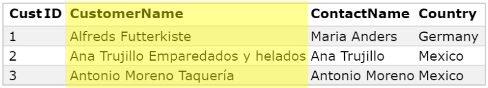

# The Outer Join
- All the records of one table along with the matching records of another table make up the output
- Types:
  - Left Outer Join
  - Right Outer Join


# Left Outer Join
### The output is comprised of . . .  
- **All rows** of the **left** table, _even if they do not satisfy the matching condition_
- The **matching rows** of the **right** table 
- `NULL` in the spaces that come from the **right** table _where the matching condition is not satisfied_

## Here's an example

### Two tables, Orders and Customers, are shown below


### The `SELECT` statement shows which columns between the two tables are going to be included in the output:
```
SELECT Orders.OrderID, Customers.CustomerName, Orders.OrderDate
```




### In the code below . . .
```
FROM Orders LEFT JOIN Customers ON Orders.CustomerID=Customers.CustomerID;
```
. . . **All records** from the **left** table and **matching rows** from the **right** table are highlighted below


### Together, the query below . . .
``` 
SELECT Orders.OrderID, Customers.CustomerName, Orders.OrderDate
FROM Orders LEFT JOIN Customers ON Orders.CustomerID=Customers.CustomerID;
```
### . . . results in the following output:


# Right Outer Join
### The output is comprised of . . .  
- **All rows** of the **right** table, _even if they do not satisfy the matching condition_
- The **matching rows** of the **left** table 
- `NULL` in the spaces that come from the **left** table _where the matching condition is not satisfied_


### Continuing the example from before, in the code below . . .
```
FROM Orders RIGHT JOIN Customers ON Orders.CustomerID=Customers.CustomerID;
```
. . . **All records** from the **right** table and **matching rows** from the **left** table are highlighted below


### Together, the query below . . .
```
SELECT Orders.OrderID, Customers.CustomerName, Orders.OrderDate
FROM Orders RIGHT JOIN Customers ON Orders.CustomerID=Customers.CustomerID;
```
### . . . results in the following output:


